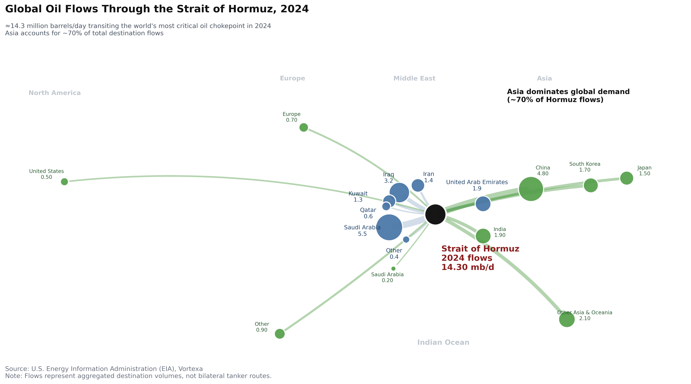
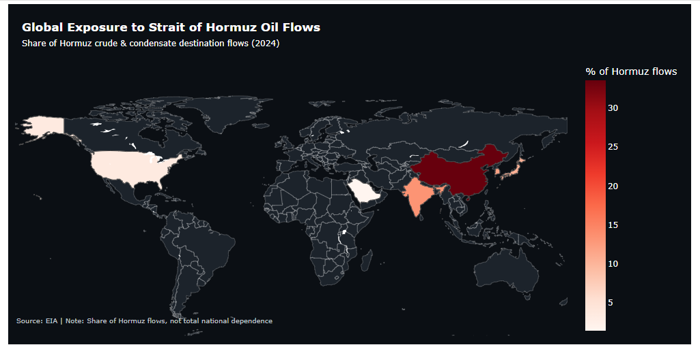

# Strait of Hormuz: Global Oil Flows, Exposure, and Disruption Risk

## Overview

The **Strait of Hormuz** is one of the world's most strategically important maritime chokepoints, serving as the primary export route for crude oil from the Persian Gulf to international markets. Despite its narrow geography, disruptions in the Strait can have far-reaching consequences for global energy supply, oil prices, inflation, and economic stability.

This project presents a data story that explores the systemic importance and vulnerability of the Strait of Hormuz through multiple complementary visualizations.

---

## Story Objective

This analysis aims to answer three key questions:

1. **Where does the oil passing through the Strait of Hormuz go?**
2. **Which countries are most dependent on oil flowing through the Strait?**
3. **How could a disruption affect global oil-importing regions?**

By combining multiple visualization techniques, the project provides both geographic and economic perspectives on one of the world's most critical energy chokepoints.

---

## Visualizations

### 1. Global Oil Flow Network

A network visualization illustrating crude oil exports from major Persian Gulf producers to importing countries.

<p align="center">
  
</p>

**Purpose**

- Visualize global oil trade flows.
- Identify the largest exporters and importers.
- Highlight the concentration of global oil shipments passing through the Strait of Hormuz.

---

### 2. Import Exposure Map

A choropleth map showing each country's dependence on crude oil transported through the Strait.

<p align="center">
  
</p>

**Purpose**

- Compare national exposure to potential disruptions.
- Identify regions most reliant on Persian Gulf oil.
- Illustrate the geographic concentration of global energy dependence.

---

### 3. Disruption Scenario Analysis

A horizontal stacked bar chart modeling the regional distribution of oil imports under a hypothetical disruption to shipments through the Strait.

<p align="center">
  
</p>

**Purpose**

- Compare regional vulnerability.
- Illustrate the distribution of oil supply across importing regions.
- Demonstrate how a localized disruption can have global consequences.

---

## Key Insights

The analysis reveals several important patterns:

- The Strait of Hormuz remains the world's most important oil chokepoint.
- Asia is the primary destination for crude oil exported through the Strait.
- China is the largest importer of oil transported through the Strait, followed by India, Japan, and South Korea.
- Global oil trade is highly concentrated, increasing vulnerability to geopolitical disruptions.
- Interruptions to shipping through the Strait could significantly affect global energy markets, inflation, and economic activity.

---

## Data Sources

The project uses publicly available data from:

- U.S. Energy Information Administration (EIA)
- Vortexa Tanker Tracking Data

---

## Tools

- Python
- Pandas
- GeoPandas
- NetworkX
- Matplotlib
- Jupyter Notebook

---

## Repository Structure

```
Strait_of_Hormuz_Data_Story/
│
├── notebook/
├── figures/
├── raw data/
└── README.md
```

- **notebook/** – Data preparation and visualization notebooks.
- **figures/** – Exported charts and maps used in the data story.

---

## Purpose

This project demonstrates how multiple visualization techniques can be integrated into a single data story.

By combining **network visualization**, **choropleth mapping**, and **scenario analysis**, the project illustrates both the structure of global oil trade and the potential consequences of disruptions to one of the world's most strategically important maritime chokepoints.

---

*This project was developed as part of a graduate-level Data Visualization course in the Master of Data Science program at the University of Pittsburgh.*
