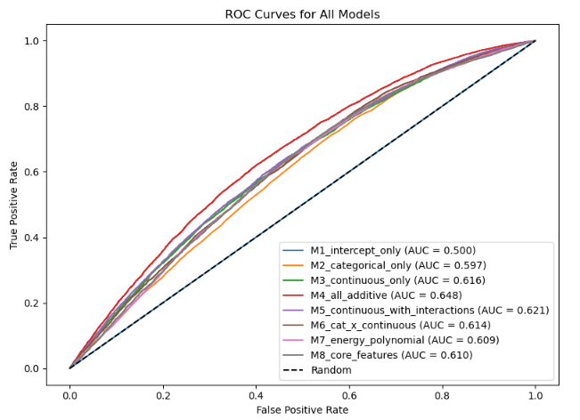
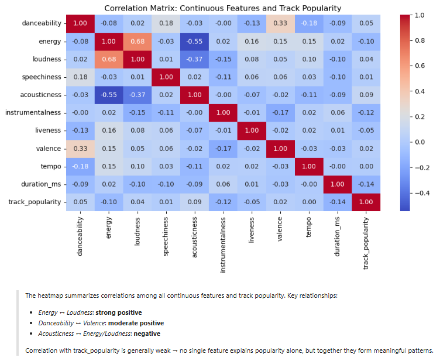
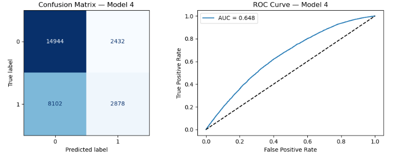

# Predicting Spotify Song Popularity

<p align="left">
  
</p>

Can a song's popularity be predicted using its audio characteristics?

This project develops and evaluates multiple **logistic regression models** to classify Spotify tracks as **Popular** or **Not Popular** using audio features and playlist metadata. The analysis follows a complete machine learning workflow, from exploratory data analysis through model comparison and evaluation.

---

## Project Objective

The goal of this project is to investigate whether measurable musical characteristics can be used to predict song popularity and to determine which combination of features produces the best-performing logistic regression model.

Key questions explored include:

- Which audio features are most associated with song popularity?
- Can logistic regression effectively classify popular and non-popular songs?
- Which model specification provides the strongest predictive performance?

---

## Dataset

The analysis uses the **Spotify Songs** dataset from TidyTuesday, containing thousands of tracks with audio features, playlist information, and popularity scores.

### Features include

- Danceability
- Energy
- Loudness
- Speechiness
- Acousticness
- Instrumentalness
- Liveness
- Valence
- Tempo
- Duration
- Musical Key
- Mode
- Playlist Genre
- Playlist Subgenre

Song popularity was transformed into a binary target variable by classifying tracks as either **Popular** or **Not Popular**.

---

## Project Workflow

The project follows a complete machine learning pipeline:

1. Data cleaning and preprocessing
2. Exploratory Data Analysis (EDA)
3. Feature engineering
4. Logistic regression model development
5. Model comparison
6. Model evaluation
7. Interpretation of results

---

# Exploratory Data Analysis

The exploratory analysis examines the structure of the dataset and relationships among variables using summary statistics and visualizations.

## Correlation Heatmap

<p align="center">
  
</p>

The correlation heatmap illustrates the relationships among continuous audio features and track popularity. It helps identify variables that are positively or negatively associated with popularity while also revealing potential multicollinearity among predictors.

---

# Model Development

Eight logistic regression models were developed using different combinations of continuous variables, categorical variables, interaction terms, and polynomial features.

The models were compared using Receiver Operating Characteristic (ROC) analysis to determine which specification produced the strongest classification performance.

## ROC Curve Comparison

<p align="center">
  
</p>

The figure compares the ROC curves for all eight logistic regression models.

Model 4, which combines continuous and categorical predictors using an additive specification, achieved the highest performance with an **Area Under the Curve (AUC) of 0.648** and was selected as the final model.

---

# Final Model Evaluation

## Confusion Matrix

<p align="center">
  
</p>

The confusion matrix summarizes the classification performance of the selected logistic regression model by comparing predicted and actual song popularity labels. It highlights correctly classified observations as well as false positives and false negatives, providing insight into the model's prediction accuracy.

---

# Technologies

- Python
- Pandas
- NumPy
- Matplotlib
- Seaborn
- Scikit-learn
- Statsmodels
- Jupyter Notebook

---

# Repository Structure

```text
Predicting_Spotify_Song_Popularity/
│
├── notebook/
│   └── Predicting_Spotify_Song_Popularity.ipynb
│
├── figures/
│   ├── correlation_heatmap.png
│   ├── roc_all_models.png
│   └── confusion_matrix.png
│
├── raw_data/
│   └── spotify_songs.csv
│
├── README.md
└── requirements.txt
```

---

# Key Results

- Built and compared **eight logistic regression models** for binary song popularity classification.
- Model performance improved by incorporating both continuous and categorical predictors.
- The best-performing model achieved an **AUC of 0.648**, outperforming simpler baseline models.
- Audio characteristics provide useful predictive information, although song popularity is also influenced by factors not captured in the dataset, such as marketing, artist popularity, and listener behavior.

---

# Future Improvements

Potential enhancements include:

- Random Forest and Gradient Boosting models
- XGBoost or LightGBM
- Hyperparameter optimization
- Feature selection techniques
- Class imbalance handling
- Model explainability using SHAP values

---

*This project was completed as part of the Master of Data Science program at the University of Pittsburgh. It demonstrates a complete supervised machine learning workflow, including exploratory data analysis, feature engineering, model comparison, and logistic regression model evaluation.*
